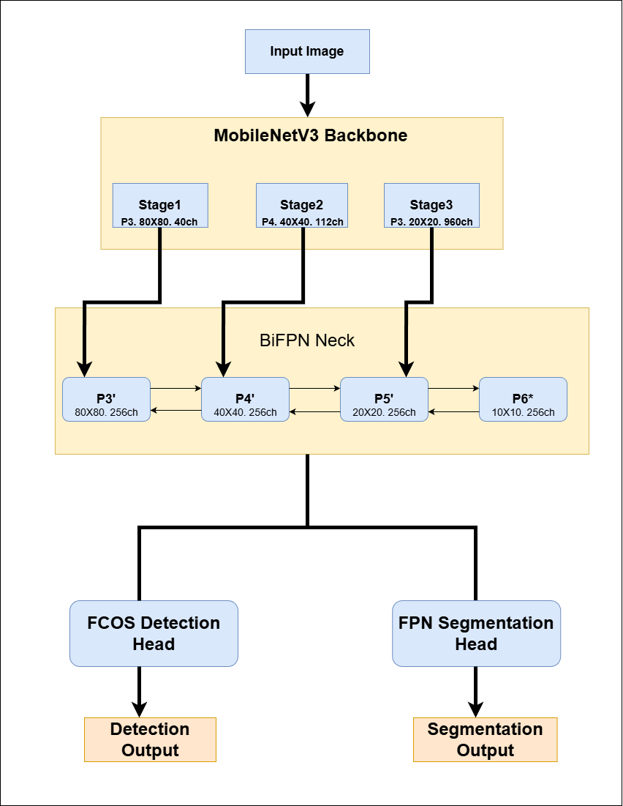
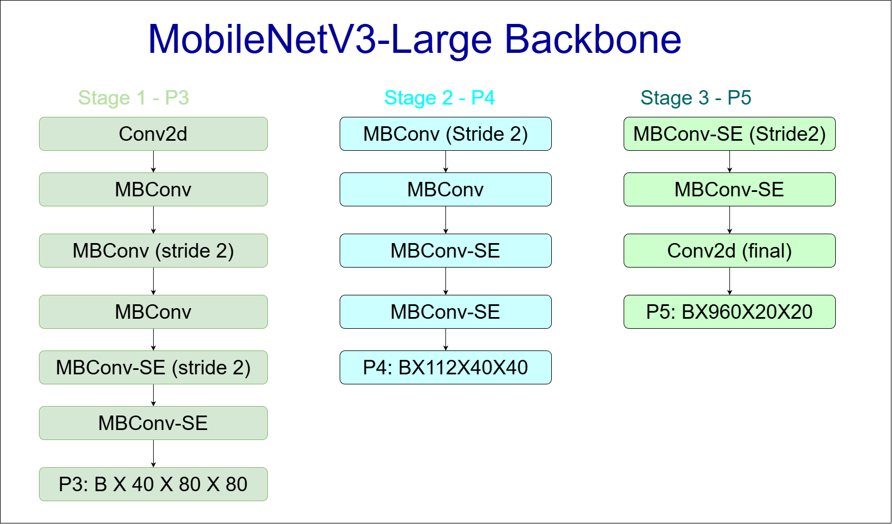
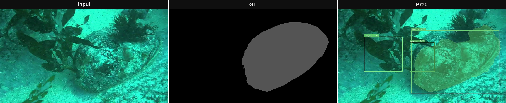
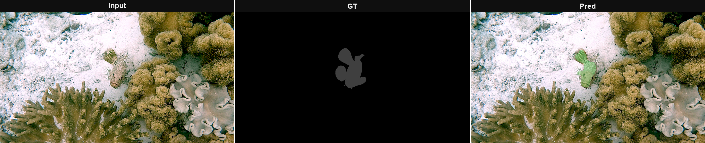
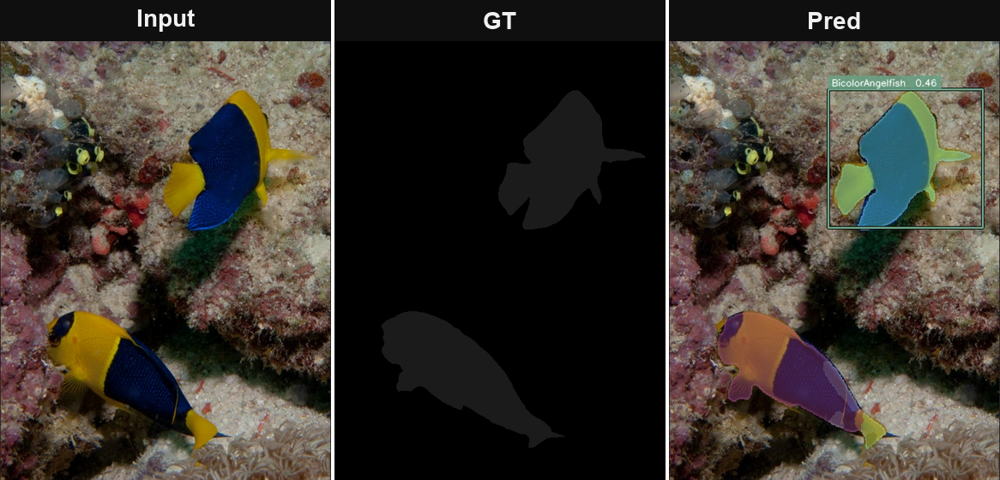
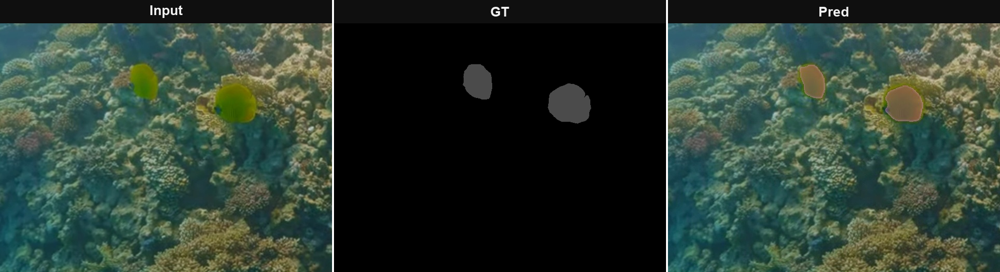
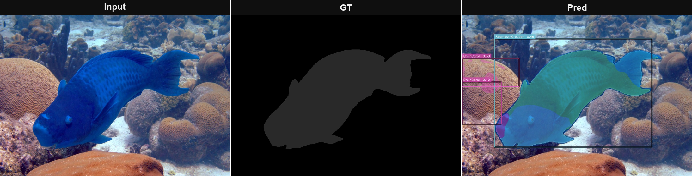
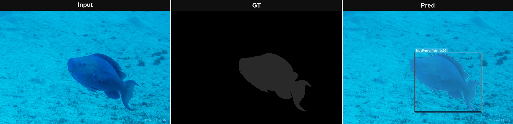

<div align="center">

# LiteFishSeg

### Lightweight Real-Time Joint Detection and Segmentation for Underwater Marine Life

[](https://www.python.org/)
[](https://pytorch.org/)
[](https://pytorch.org/vision/stable/models/mobilenetv3.html)
[](https://github.com/LiamLian0852/USIS10K)
[](LICENSE)

</div>

---

## Overview

LiteFishSeg is the **speed-first counterpart to [FishSegDet](https://github.com/MahboobAlam0/FishSegDet)**. Both models solve the same task — joint bounding-box detection and instance segmentation of underwater marine life on USIS16K — but LiteFishSeg is designed for deployment scenarios where latency matters: on-vessel edge hardware, real-time video monitoring systems, or rapid iteration during data collection.

The architecture trades FishSegDet's ConvNeXtV2-Large backbone and Distribution Focal Loss for a MobileNetV3-Large backbone and an FCOS head, cutting parameter count by roughly **22×** (204.75M → 9.08M) while keeping the same dual-output (detection + segmentation) contract.

---

## The Accuracy vs. Speed Trade-off

| | FishSegDet | LiteFishSeg |
|---|---|---|
| **Backbone** | ConvNeXtV2-Large | MobileNetV3-Large |
| **Detection head** | DFL + TAL assignment | FCOS + Focal Loss + centerness |
| **FPN levels** | 4 (P3–P6, strides 8–64) | 3 (P3–P5, strides 8–32) |
| **Neck channels** | 256 | 128 |
| **Mask prototype dim** | 128 | 64 |
| **Total params** | **204.75 M** | **9.08 M** |
| **mAP** | **74.34 %** | 45.10 % |
| **mAP₅₀** | **97.73 %** | 73.72 % |
| **mIoU** | **94.41 %** | 80.30 % |
| **Dice** | **95.84 %** | 81.51 % |
| **Default image size** | 640 px | 512 px |
| **Use case** | High-accuracy analysis | Real-time / edge deployment |

When accuracy is the priority, use FishSegDet. When you need inference on a constrained device or within a latency budget, LiteFishSeg delivers competitive segmentation quality (mIoU 80.3 %) at **22× fewer parameters**.

---

## Architecture

### Overview



### Component Diagrams

<table>
  <tr>
    <td align="center">
      <b>Backbone — MobileNetV3-Large (Stage-by-stage breakdown)</b><br><br>
      
    </td>
  </tr>
</table>

### Design Decisions

| Component | Choice | Why |
|---|---|---|
| Backbone | MobileNetV3-Large | Inverted residuals and Hard-Swish activations are specifically optimised for throughput on mobile/edge hardware; ImageNet-V2 pre-training converges faster than V1 |
| Neck | BiFPN × 2, 128ch, P3–P5 | Dropping P6 removes the need to downsample twice from the backbone; 128ch neck has ~4× fewer parameters than FishSegDet's 256ch neck |
| Detection | FCOS + Focal Loss | Direct LTRB regression with 4 output channels is faster to decode than DFL's 4×17 logits; centerness suppresses off-centre false positives without TAL's per-anchor IoU computation |
| Box loss | GIoU | Sufficient quality for a lightweight model; CIoU's aspect-ratio term gives marginal gains that don't justify the cost here |
| Cls loss | Focal Loss (α=0.25, γ=2.0) | Down-weights the contribution of easy negatives, critical for anchor-free detectors where the positive/negative ratio is heavily skewed |
| Segmentation | FPN + ASPP + prototype | Same design as FishSegDet at 64-d instead of 128-d; halves memory and compute in the decoder |
| Seg loss | CE + Dice (λ=3.0) | Higher Dice weight than FishSegDet compensates for the reduced capacity of a smaller backbone |

---

## Training Strategy

### 3-Phase Curriculum

| Phase | Epochs | Backbone | Augmentation | Backbone LR | Head LR |
|---|---|---|---|---|---|
| 1 | 15 | Frozen | Standard geometry + colour | — | 5e-4 |
| 2 | 50 | Unfrozen | Standard | 5e-5 | 5e-4 |
| 3 | 20 | Unfrozen | Heavy (fog, motion blur, distortion) | 5e-5 | 5e-4 |

**Rationale:** The shorter Phase 1 vs FishSegDet reflects MobileNetV3's smaller capacity — the heads converge faster when the backbone provides weaker but still stable features. Phase 3 introduces heavy augmentation only after the model has fully adapted to the underwater domain.

### Speed Optimisations

All optimisations are applied by default; none require code changes.

| Optimisation | Flag / Default | Effect |
|---|---|---|
| AMP (fp16 forward/backward) | default ON | ~1.5–2× training throughput |
| `channels_last` memory format | default ON | Improves conv throughput on NCHW-optimised hardware |
| `cudnn.benchmark = True` | default ON (CUDA) | Auto-selects fastest convolution algorithm per input size |
| EMA weights | default ON | Stabilises final checkpoint quality at negligible cost |
| Reduced val frequency | `--val-interval 5` | Validates every 5 epochs instead of every epoch |
| `torch.compile` | `--compile` | JIT compilation, ~10–30% inference speedup after warm-up |

### Additional Training Details

- **Scheduler:** 5-epoch cosine warm-up → cosine annealing decay per phase
- **Optimiser:** AdamW, weight decay 0.01
- **EMA decay:** 0.9999, shadow copy on CPU (zero VRAM overhead)
- **Default image size:** 512px (640px supported; 512px trains ~25% faster with minimal accuracy loss)

---

## Evaluation Metrics

LiteFishSeg is evaluated against YOLOv10l-seg and YOLOv11l-seg — both significantly heavier models — on the USIS16K test split.

| Model | Params | mAP | mAP₅₀ | mIoU | Dice | Precision | Recall | Pixel Acc |
|---|---|---|---|---|---|---|---|---|
| YOLOv10l-seg \[64\] | ~24.4 M | 64.10 % | 85.50 % | 84.32 % | 83.92 % | 82.40 % | 85.50 % | 91.00 % |
| YOLOv11l-seg \[65\] | ~27.71 M | 67.30 % | 88.00 % | 86.45 % | 86.12 % | 85.27 % | 87.00 % | 93.25 % |
| **LiteFishSeg (Ours)** | **~9.08 M** | 45.10 % | 73.72 % | 80.30 % | 81.51 % | 80.45 % | 82.61 % | 88.70 % |

LiteFishSeg achieves **mIoU 80.3 %** and **Dice 81.51 %** using only **9.08 M parameters** — **2.7× fewer than YOLOv10l-seg** and **3× fewer than YOLOv11l-seg**. The detection gap (mAP 45.1 % vs 67.3 %) reflects the architectural trade-off: FCOS with direct regression and a 128-channel neck is substantially lighter than DFL with TAL assignment and a 256-channel neck. For applications where segmentation quality and deployment footprint matter more than detection mAP, LiteFishSeg is the right choice.

---

## Visual Results

Each panel shows **Input image · Ground truth mask · Model prediction** (segmentation overlay + bounding box).

<table>
  <tr>
    <td align="center">
      <b>Abalone</b><br>
      
    </td>
  </tr>
  <tr>
    <td align="center">
      <b>Anyperodon Leucogrammicus</b><br>
      
    </td>
  </tr>
  <tr>
    <td align="center">
      <b>Bicolor Angelfish</b><br>
      
    </td>
  </tr>
  <tr>
    <td align="center">
      <b>Bluecheek Butterflyfish</b><br>
      
    </td>
  </tr>
  <tr>
    <td align="center">
      <b>Blue Parrotfish (i)</b><br>
      
    </td>
  </tr>
  <tr>
    <td align="center">
      <b>Blue Parrotfish (ii)</b><br>
      
    </td>
  </tr>
</table>

---

## Quick Start

### Installation

```bash
git clone https://github.com/<your-username>/LiteFishSeg.git
cd LiteFishSeg
pip install -r requirements.txt
```

Requires Python ≥ 3.9, PyTorch ≥ 2.0, CUDA 11.8+.

### Dataset Layout

```
USIS16K/
├── train/                          # training images
├── val/                            # validation images
├── test/                           # test images
└── annotations/
    ├── instances_train.json
    ├── instances_val.json
    └── instances_test.json
```

Class names are read from the annotation file automatically — no manual configuration required.

### Train

```bash
# Default: MobileNetV3-Large, 512px, USIS16K
python train.py --data ./USIS16K --device cuda

# Maximum speed (smaller images, compile enabled)
python train.py --data ./USIS16K --img-size 512 --compile

# Validate every 5 epochs to reduce overhead
python train.py --data ./USIS16K --val-interval 5

# Resume from checkpoint
python train.py --data ./USIS16K --resume runs/litefishseg_20240901/best.pt
```

Checkpoints, CSV metrics log, and optional TensorBoard logs are written to `runs/litefishseg_<timestamp>/`.

### Evaluate

```bash
# Full test-set evaluation with per-class breakdown
python test.py --weights runs/litefishseg_20240901/best.pt --data ./USIS16K --eval

# Evaluation + save overlay visualisations
python test.py --weights runs/litefishseg_20240901/best.pt --data ./USIS16K --eval --save-vis
```

### Inference

```bash
# Single image — displays result in a window
python test.py --weights best.pt --image sample.jpg

# Folder — saves overlays to ./results/
python test.py --weights best.pt --folder ./images/ --out-dir ./results/
```

### Publication Figures

```bash
# One representative image per class, IEEE/Springer layout
python visualization_pub.py --weights best.pt --data ./USIS16K

# Camera-ready PDF at 600 dpi
python visualization_pub.py --weights best.pt --data ./USIS16K --format pdf
```

---

## Project Structure

```
LiteFishSeg/
├── litefishseg/                    # installable Python package
│   ├── config.py                   # Config dataclass · CFG singleton · class maps
│   ├── models/
│   │   ├── blocks.py               # ConvBN, DWConv  (shared primitives)
│   │   ├── backbone.py             # MobileNetV3LargeBackbone
│   │   ├── neck.py                 # BiFPN  (weighted bidirectional FPN)
│   │   ├── heads.py                # FCOSHead (cls · centerness · box) · FPNSegHead
│   │   └── detector.py             # LiteFishSeg · build_model()
│   ├── data/
│   │   ├── preprocessing.py        # UnderwaterPreprocessor  (WB → CLAHE → γ)
│   │   ├── augmentations.py        # get_train · get_val · get_heavy transforms
│   │   ├── datasets.py             # USISDataset  (COCO format)
│   │   └── loaders.py              # configure_dataset() · create_dataloaders()
│   ├── losses/
│   │   └── detection.py            # LiteFishSegLoss  (FCOS · Focal · GIoU · centerness · Dice)
│   └── engine/
│       └── inference.py            # LiteFishSegInference  (preprocess · decode · NMS · visualise)
├── train.py                        # training entry point
├── visualization_pub.py            # publication-quality qualitative results
├── requirements.txt
└── README.md
```

---

## Requirements

```
torch>=2.0.0       torchvision>=0.15.0
albumentations>=1.3.0    opencv-python>=4.7.0    pycocotools>=2.0.6
numpy>=1.24.0      tqdm>=4.65.0           matplotlib>=3.7.0
```

---

## License

[MIT](LICENSE)
